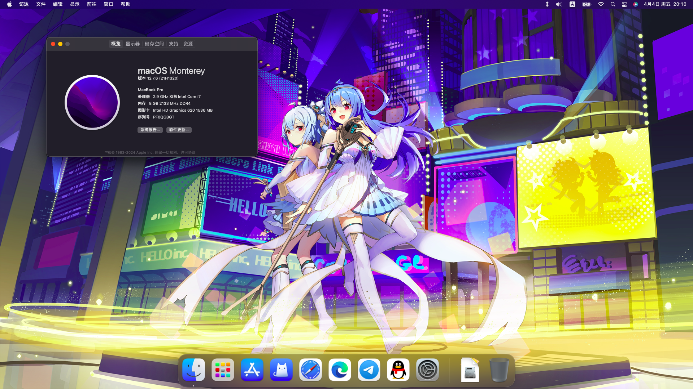

# Lenovo-Xiaoxin-310-15IKB-EFI
联想小新310-15ikb的黑苹果完美EFI，Lenovo Xiaoxin 310-15IKB macOS perfect EFI\
\

## ✨ 说明
并非个人制作，网上购买+淘宝远程得到这个东拼西凑出的EFI，凑出这个还算完美的EFI，之前闲的没事干想给这个电脑装Catalina，结果自己弄的EFI只驱动了wifi蓝牙声卡，核显没有驱动，最后发现网上有卖这个机型的EFI，使用后发现亮度无法调节，自己修了半天也没修好（），最后找了淘宝远程修好了亮度。\
\
显存现在显示1536MB，这个问题如果我能修好就上传，如果你会修也可以自己修好然后使用。

## ✨ 配置
| 硬件      | 型号                             |
|-----------|----------------------------------|
| 处理器    | Intel Core i7-7500U              |
| 核显      | Intel HD Graphics 620            |
| 独显      | NVIDIA GeForce 920M              |
| 内存      | 8GB DDR4 2133MHz                 |
| 网卡+蓝牙 | Intel Dual Band Wireless-AC 3165 |
| 声卡      | Conexant CX20751/2               |
| 屏幕      | 15.6" LCD 1920 x 1080            |

## ✨ 还没写完
等待更新\
\
如果有人下载,\
蓝牙 wifi 电池 usb hdmi 触控板等都能工作，\
icloud也可以通过特定方法登录，直接从设置是无法登录的，\
具体方法就是先去App Store登录Apple ID，然后再去邮件里面登录，过一会就会自动登录上icloud了
